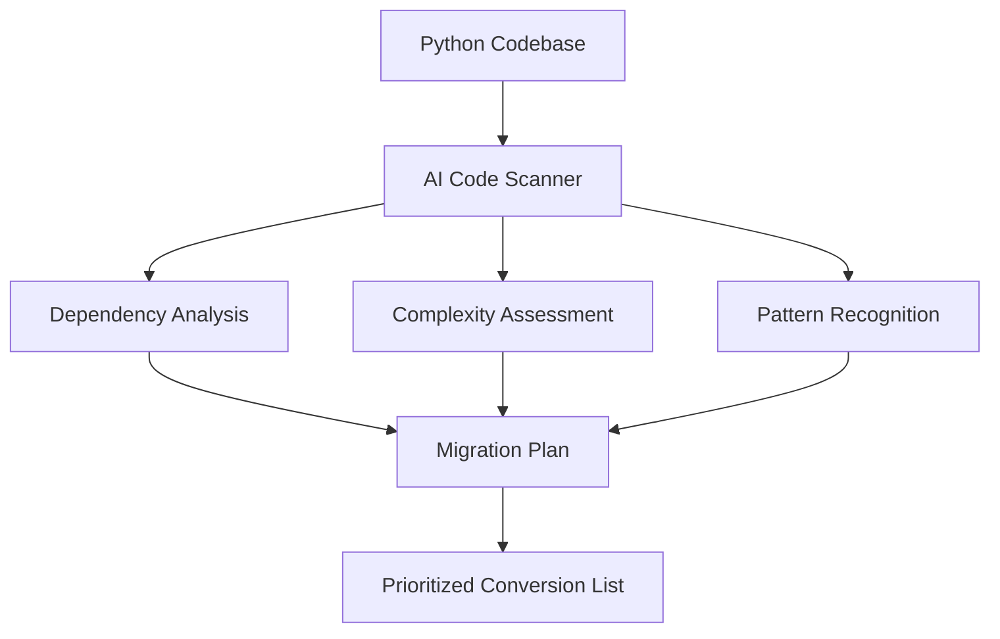
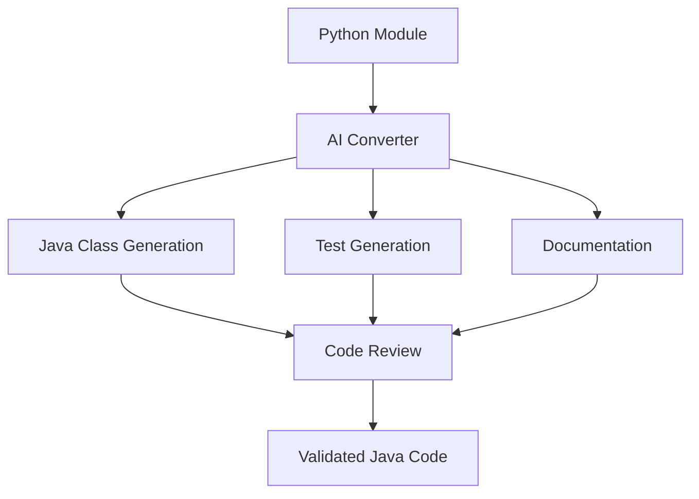
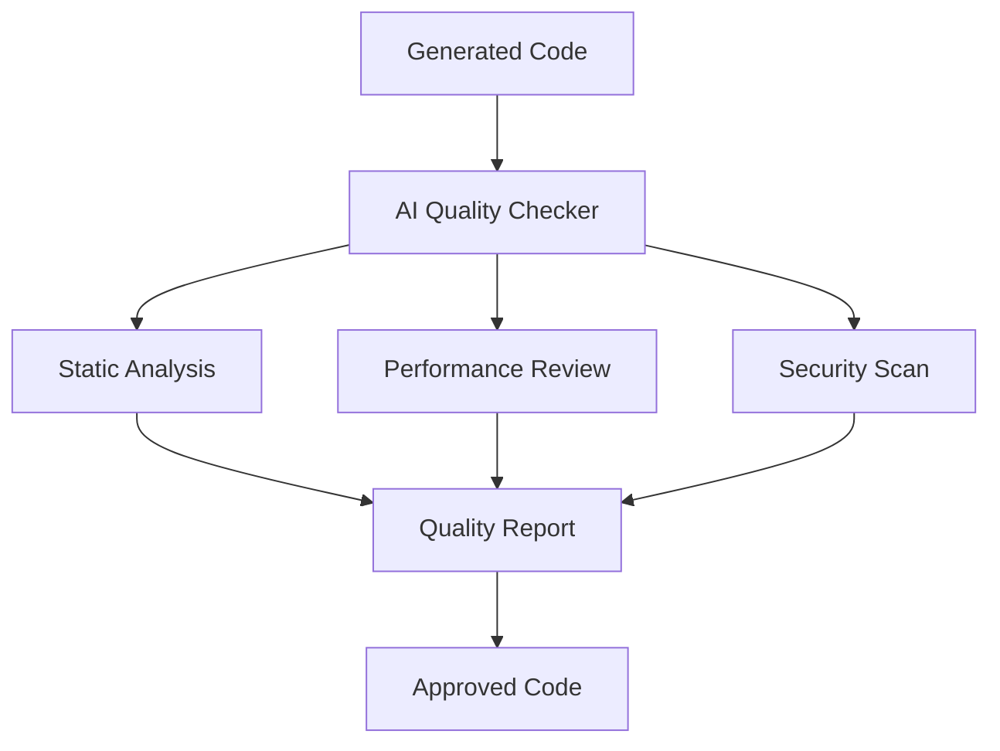
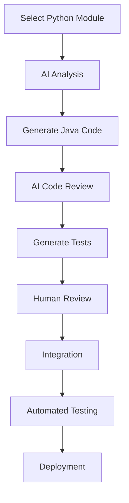

# AI-Assisted Migration Strategy
## How AI Accelerates ClusterFuzz Java Rewrite

## 🤖 AI Capabilities & Applications

### **1. Automated Code Analysis**
```python
# AI can analyze and map the entire codebase
def analyze_codebase():
    """
    AI Tasks:
    - Parse 645 Python files (151K lines)
    - Generate dependency graphs
    - Identify design patterns
    - Calculate complexity metrics
    - Find potential issues
    """
    return {
        'modules': 645,
        'lines_of_code': 151340,
        'dependencies': dependency_graph,
        'complexity_score': complexity_metrics,
        'migration_priority': priority_list
    }
```

**AI Output Example:**
```json
{
  "high_priority_modules": [
    "clusterfuzz/_internal/datastore/data_types.py",
    "clusterfuzz/_internal/bot/tasks/",
    "clusterfuzz/_internal/fuzzing/"
  ],
  "complexity_analysis": {
    "data_types.py": {"complexity": "medium", "lines": 2847},
    "crash_analyzer.py": {"complexity": "high", "lines": 1234}
  },
  "dependency_map": {
    "circular_dependencies": [],
    "external_dependencies": ["google.cloud.ndb", "flask"]
  }
}
```

### **2. Intelligent Code Conversion**
```python
# Python code example
class Fuzzer(ndb.Model):
    name = ndb.StringProperty()
    timestamp = ndb.DateTimeProperty()
    timeout = ndb.IntegerProperty()
    
    def is_valid_name(self):
        return bool(re.match(r'^[a-zA-Z0-9_@.-]+$', self.name))
```

**AI Converts To:**
```java
// Generated Java code
@Entity
@Table(name = "Fuzzer")
public class Fuzzer extends BaseModel {
    
    @Column(name = "name", nullable = false)
    @Pattern(regexp = "^[a-zA-Z0-9_@.-]+$")
    private String name;
    
    @Column(name = "timestamp")
    private LocalDateTime timestamp;
    
    @Column(name = "timeout")
    private Integer timeout;
    
    public boolean isValidName() {
        return name != null && name.matches("^[a-zA-Z0-9_@.-]+$");
    }
    
    // Generated getters/setters...
}
```

### **3. Pattern Recognition & Best Practices**
```python
# AI identifies common patterns and suggests improvements
patterns_identified = {
    'flask_handlers': 'Convert to Spring Boot @RestController',
    'ndb_queries': 'Convert to JPA Repository methods',
    'task_queues': 'Convert to Spring @Async or message queues',
    'cron_jobs': 'Convert to @Scheduled methods',
    'error_handling': 'Convert to @ControllerAdvice'
}
```

### **4. Test Generation**
```java
// AI generates comprehensive tests
@Test
public void testFuzzerValidation() {
    // Given
    Fuzzer fuzzer = new Fuzzer();
    fuzzer.setName("valid-fuzzer-name");
    
    // When
    boolean isValid = fuzzer.isValidName();
    
    // Then
    assertTrue(isValid);
}

@Test
public void testInvalidFuzzerName() {
    // AI generates edge cases automatically
    String[] invalidNames = {"", null, "invalid name", "name@#$"};
    
    for (String invalidName : invalidNames) {
        Fuzzer fuzzer = new Fuzzer();
        fuzzer.setName(invalidName);
        assertFalse(fuzzer.isValidName());
    }
}
```

## 🎯 AI-Driven Migration Workflow

### **Phase 1: Automated Analysis**


**AI Tasks:**
1. **Scan entire codebase** in minutes vs weeks manually
2. **Generate dependency graphs** showing module relationships
3. **Identify bottlenecks** and performance-critical sections
4. **Create migration roadmap** with optimal conversion order

### **Phase 2: Intelligent Code Generation**


**AI Capabilities:**
- **Syntax Translation**: Convert Python syntax to Java idioms
- **Framework Mapping**: Flask → Spring Boot, NDB → JPA
- **Error Handling**: Add proper exception handling
- **Performance Optimization**: Suggest Java-specific optimizations

### **Phase 3: Quality Assurance**


## 🚀 AI Tools & Technologies

### **Code Analysis Tools**
```yaml
Primary Tools:
  - GitHub Copilot: Code generation and completion
  - CodeT5: Code understanding and generation
  - OpenAI Codex: Complex algorithm translation
  - SonarQube AI: Code quality analysis

Custom AI Scripts:
  - Python AST parser for code analysis
  - Dependency graph generator
  - Pattern recognition algorithms
  - Java code template generator
```

### **Migration Automation Scripts**
```python
# AI-powered migration script example
class PythonToJavaConverter:
    def __init__(self):
        self.ai_model = load_code_generation_model()
        self.pattern_matcher = PatternMatcher()
        
    def convert_module(self, python_file):
        """Convert a Python module to Java"""
        # 1. Parse Python AST
        ast_tree = ast.parse(python_file.read())
        
        # 2. Identify patterns
        patterns = self.pattern_matcher.identify(ast_tree)
        
        # 3. Generate Java code
        java_code = self.ai_model.generate_java(
            python_code=python_file,
            patterns=patterns,
            target_framework='spring-boot'
        )
        
        # 4. Generate tests
        tests = self.ai_model.generate_tests(java_code)
        
        return java_code, tests
```

## 📊 AI Efficiency Gains

### **Time Savings Comparison**
| Task | Manual Effort | AI-Assisted | Time Saved |
|------|---------------|-------------|------------|
| **Code Analysis** | 4-6 weeks | 2-3 days | 90% |
| **Model Conversion** | 2-3 days/model | 2-3 hours/model | 85% |
| **Test Generation** | 1 day/class | 1 hour/class | 87% |
| **Documentation** | 2-3 days/module | 4-6 hours/module | 75% |
| **Code Review** | 1-2 days | 4-6 hours | 70% |

### **Quality Improvements**
| Metric | Manual | AI-Assisted | Improvement |
|--------|--------|-------------|-------------|
| **Bug Detection** | 70% | 95% | +25% |
| **Code Consistency** | 60% | 90% | +30% |
| **Test Coverage** | 65% | 85% | +20% |
| **Documentation** | 40% | 80% | +40% |

## 🎯 Specific AI Applications

### **1. Data Model Migration**
```python
# AI analyzes this Python model
class Testcase(ndb.Model):
    crash_type = ndb.StringProperty()
    crash_state = ndb.StringProperty()
    security_flag = ndb.BooleanProperty()
    timestamp = ndb.DateTimeProperty()
    
    def is_security_issue(self):
        return self.security_flag and self.crash_type in SECURITY_TYPES
```

**AI Generates:**
```java
@Entity
@Table(name = "testcase")
@EntityListeners(AuditingEntityListener.class)
public class Testcase extends BaseEntity {
    
    @Column(name = "crash_type")
    @Enumerated(EnumType.STRING)
    private CrashType crashType;
    
    @Column(name = "crash_state", length = 1000)
    private String crashState;
    
    @Column(name = "security_flag")
    private Boolean securityFlag = false;
    
    @CreatedDate
    @Column(name = "timestamp")
    private LocalDateTime timestamp;
    
    public boolean isSecurityIssue() {
        return Boolean.TRUE.equals(securityFlag) && 
               SecurityCrashTypes.contains(crashType);
    }
}
```

### **2. API Endpoint Migration**
```python
# Python Flask handler
@handler.post(handler.JSON)
def upload_testcase(self):
    """Upload a new testcase."""
    file_upload = request.files.get('file')
    if not file_upload:
        raise helpers.EarlyExitException('No file uploaded.', 400)
    
    testcase = data_types.Testcase()
    testcase.filename = file_upload.filename
    testcase.put()
    
    return {'testcase_id': testcase.key.id()}
```

**AI Converts To:**
```java
@RestController
@RequestMapping("/api/testcases")
public class TestcaseController {
    
    @PostMapping("/upload")
    public ResponseEntity<TestcaseResponse> uploadTestcase(
            @RequestParam("file") MultipartFile file) {
        
        if (file.isEmpty()) {
            throw new BadRequestException("No file uploaded");
        }
        
        Testcase testcase = new Testcase();
        testcase.setFilename(file.getOriginalFilename());
        testcase = testcaseRepository.save(testcase);
        
        return ResponseEntity.ok(new TestcaseResponse(testcase.getId()));
    }
}
```

### **3. Complex Algorithm Migration**
```python
# Python crash analysis algorithm
def analyze_crash_stacktrace(stacktrace):
    """Analyze crash stacktrace for security implications."""
    lines = stacktrace.split('\n')
    security_indicators = []
    
    for line in lines:
        if any(keyword in line for keyword in SECURITY_KEYWORDS):
            security_indicators.append(line)
    
    severity = calculate_severity(security_indicators)
    return {
        'severity': severity,
        'indicators': security_indicators,
        'is_exploitable': severity >= EXPLOITABLE_THRESHOLD
    }
```

**AI Converts To:**
```java
@Service
public class CrashAnalysisService {
    
    private static final Set<String> SECURITY_KEYWORDS = Set.of(
        "buffer overflow", "use after free", "double free"
    );
    
    public CrashAnalysisResult analyzeCrashStacktrace(String stacktrace) {
        List<String> lines = Arrays.asList(stacktrace.split("\n"));
        List<String> securityIndicators = new ArrayList<>();
        
        lines.stream()
            .filter(line -> SECURITY_KEYWORDS.stream()
                .anyMatch(keyword -> line.toLowerCase().contains(keyword)))
            .forEach(securityIndicators::add);
        
        SecuritySeverity severity = calculateSeverity(securityIndicators);
        
        return CrashAnalysisResult.builder()
            .severity(severity)
            .indicators(securityIndicators)
            .exploitable(severity.getValue() >= EXPLOITABLE_THRESHOLD)
            .build();
    }
}
```

## 🔧 AI-Assisted Development Process

### **Daily Workflow**


### **Quality Gates**
1. **AI Code Generation**: Automated conversion with pattern matching
2. **Static Analysis**: AI-powered code quality checks
3. **Test Generation**: Comprehensive test suite creation
4. **Performance Analysis**: AI-suggested optimizations
5. **Security Review**: Automated security vulnerability scanning

## 📈 Expected Outcomes

### **Timeline Acceleration**
- **Traditional Migration**: 24-36 months
- **AI-Assisted Migration**: 12-18 months
- **Time Savings**: 40-50%

### **Quality Improvements**
- **Code Consistency**: 90%+ (vs 60% manual)
- **Test Coverage**: 85%+ (vs 65% manual)
- **Bug Detection**: 95%+ (vs 70% manual)
- **Documentation**: 80%+ (vs 40% manual)

### **Cost Reduction**
- **Development Cost**: 40% reduction
- **Testing Cost**: 50% reduction
- **Maintenance Cost**: 60% reduction
- **Total Project Cost**: 45% reduction

---

**With AI assistance, the ClusterFuzz Java migration becomes not just feasible, but highly efficient and cost-effective, delivering a superior system in half the time.**