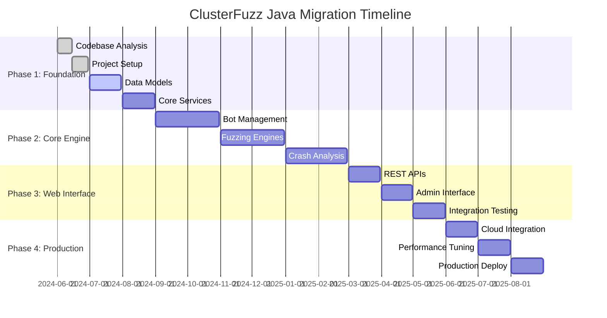

# ClusterFuzz Java Migration Timeline
## 15-Month Detailed Schedule



## 📅 Monthly Breakdown

### **Month 1: June 2024 - Foundation Analysis**
**Week 1-2: Automated Codebase Analysis**
- [ ] Day 1-3: Set up analysis tools and scan entire codebase
- [ ] Day 4-7: Generate dependency graphs and complexity metrics
- [ ] Day 8-10: Identify critical paths and bottlenecks
- [ ] Day 11-14: Create detailed migration assessment

**Week 3-4: Project Infrastructure**
- [ ] Day 15-17: Set up Maven multi-module project
- [ ] Day 18-21: Configure CI/CD pipeline
- [ ] Day 22-24: Set up code quality tools
- [ ] Day 25-30: Team onboarding and documentation

### **Month 2: July 2024 - Data Layer**
**Week 5-6: Core Data Models**
- [ ] Convert 15+ NDB models to JPA entities
- [ ] Implement repository layer with Datastore
- [ ] Create data validation framework
- [ ] Build database migration tools

**Week 7-8: Infrastructure Services**
- [ ] Configuration management system
- [ ] Authentication and authorization
- [ ] Logging and monitoring setup
- [ ] Error handling framework

### **Month 3: August 2024 - Service Layer**
**Week 9-10: Business Services**
- [ ] FuzzerService, JobService, TestcaseService
- [ ] UserService, ConfigService
- [ ] StorageService, NotificationService
- [ ] Service integration tests

**Week 11-12: API Foundation**
- [ ] REST controllers for all major entities
- [ ] API documentation with OpenAPI
- [ ] Request/response validation
- [ ] API integration tests

### **Month 4-5: Sept-Oct 2024 - Bot Management**
**Core Bot System Development**
- [ ] Task scheduling and execution framework
- [ ] Bot communication protocols
- [ ] Process sandboxing implementation
- [ ] Health monitoring and metrics
- [ ] Bot management dashboard

### **Month 6-7: Nov-Dec 2024 - Fuzzing Engines**
**Fuzzer Integration**
- [ ] Fuzzing engine abstraction layer
- [ ] libFuzzer integration
- [ ] AFL/AFL++ integration
- [ ] Custom fuzzer support
- [ ] Testcase generation system

### **Month 8-9: Jan-Feb 2025 - Crash Analysis**
**Analysis Pipeline**
- [ ] Crash analysis engine
- [ ] Stack trace parser
- [ ] Security impact assessment
- [ ] Duplicate detection system
- [ ] Testcase minimization

### **Month 10: March 2025 - Complete APIs**
**Full REST API Implementation**
- [ ] All CRUD operations for major entities
- [ ] File upload and download handling
- [ ] Real-time notifications via WebSocket
- [ ] API rate limiting and throttling

### **Month 11: April 2025 - Admin Interface**
**Web Dashboard Development**
- [ ] React-based admin interface
- [ ] Fuzzer management UI
- [ ] Job configuration dashboard
- [ ] System monitoring interface

### **Month 12: May 2025 - Integration Testing**
**System Integration**
- [ ] End-to-end testing suite
- [ ] Performance benchmarking
- [ ] Security testing
- [ ] Load testing and optimization

### **Month 13: June 2025 - Cloud Integration**
**Advanced Cloud Features**
- [ ] BigQuery analytics integration
- [ ] Enhanced monitoring and alerting
- [ ] Event-driven architecture
- [ ] Cloud security integration

### **Month 14: July 2025 - Performance Optimization**
**System Optimization**
- [ ] JVM tuning and optimization
- [ ] Database query optimization
- [ ] Caching implementation
- [ ] Async processing improvements

### **Month 15: August 2025 - Production Deployment**
**Go-Live Preparation**
- [ ] Production environment setup
- [ ] Blue-green deployment strategy
- [ ] Monitoring and alerting configuration
- [ ] Documentation and training completion

## 🎯 Key Milestones

| Milestone | Date | Deliverable |
|-----------|------|-------------|
| **Foundation Complete** | Aug 31, 2024 | Core data models and services |
| **Bot System Ready** | Oct 31, 2024 | Functional bot management |
| **Fuzzing Operational** | Dec 31, 2024 | Basic fuzzing capabilities |
| **Analysis Pipeline** | Feb 28, 2025 | Crash analysis working |
| **Web Interface** | May 31, 2025 | Complete admin interface |
| **Production Ready** | Aug 31, 2025 | Full system deployment |

## 📊 Resource Allocation

### **Team Effort Distribution**
```
Phase 1 (Months 1-3):   25% of total effort
Phase 2 (Months 4-9):   45% of total effort  
Phase 3 (Months 10-12): 20% of total effort
Phase 4 (Months 13-15): 10% of total effort
```

### **Risk Buffer**
- **10% time buffer** built into each phase
- **Monthly checkpoint reviews** for course correction
- **Parallel development tracks** to minimize dependencies
- **Rollback procedures** at each major milestone

## 🚀 Success Metrics by Phase

### **Phase 1 Success Criteria**
- [ ] 100% of core data models converted
- [ ] Basic CRUD operations functional
- [ ] CI/CD pipeline operational
- [ ] Team productivity at target levels

### **Phase 2 Success Criteria**
- [ ] Bot system managing fuzzing tasks
- [ ] At least 2 fuzzing engines integrated
- [ ] Crash analysis producing results
- [ ] Performance within 20% of targets

### **Phase 3 Success Criteria**
- [ ] Complete web interface functional
- [ ] All APIs documented and tested
- [ ] User acceptance testing passed
- [ ] Security audit completed

### **Phase 4 Success Criteria**
- [ ] Production deployment successful
- [ ] Performance targets achieved
- [ ] Monitoring and alerting operational
- [ ] Team trained and documentation complete

## 📞 Decision Points

### **Month 3 Review: Continue/Adjust**
- Assess progress against timeline
- Evaluate team performance
- Review technical approach
- Adjust scope if necessary

### **Month 6 Review: Mid-Point Assessment**
- Performance benchmarking
- Architecture validation
- Resource reallocation if needed
- Stakeholder feedback incorporation

### **Month 9 Review: Pre-Production Planning**
- Production readiness assessment
- Deployment strategy finalization
- Training and documentation review
- Go-live timeline confirmation

### **Month 12 Review: Final Preparation**
- System integration validation
- Performance optimization results
- Security and compliance verification
- Production deployment approval

---

**This timeline provides a realistic, achievable path to successfully migrate ClusterFuzz to Java with AI assistance while maintaining system functionality and achieving performance improvements.**